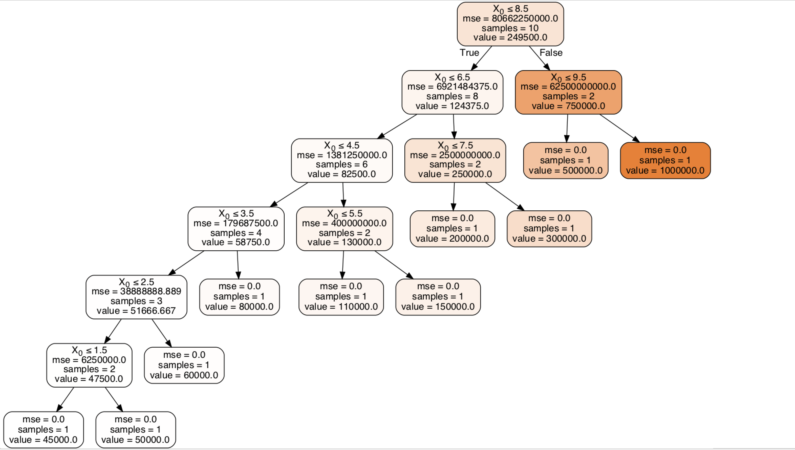

# Decision Trees

In decision analysis, a decision tree can be used to visually and explicitly represent decisions and decision making.  As the name goes, it uses a tree-like model of decisions.  Though a commonly used tool in data mining for deriving a strategy to reach a particular goal, its also widely used in machine learning. 

## Problem Statement
An employee joining a new company tell that he was a 6.5 level emplyee in his former company and and had a salary of 160K.The HR however is not conviced and decided to check whether the person is honest or not.

## Solution
Salary of employees based on their levels is predicted by  the decision tree 

## Result

 

Since the model predicts the salary to be 15000 means employee was  not honest.

