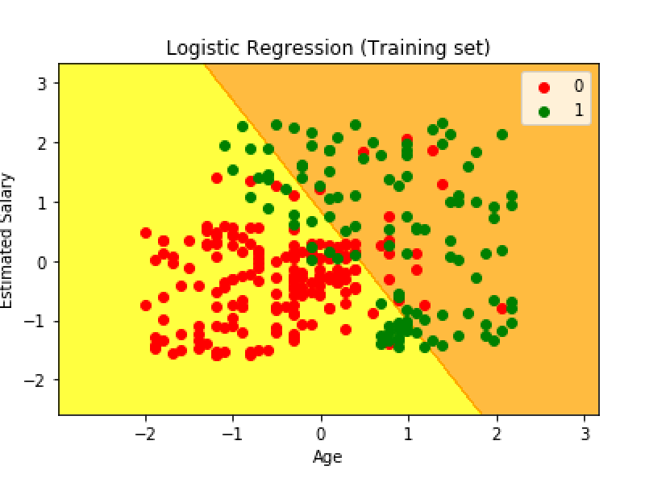
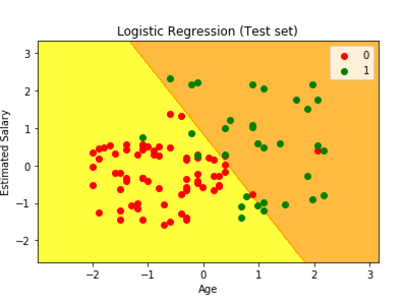

# Classification - Logisitic Regression

A classification problem is when the output variable is a category, such as “red” or “blue” or “disease” and “no disease”. A classification model attempts to draw some conclusion from observed values. Given one or more inputs a classification model will try to predict the value of one or more outcomes.
For example, when filtering emails “spam” or “not spam” 

In statistics, the logistic model  is used to model the probability of a certain class or event existing such as pass/fail, win/lose etc. Each object being detected  would be assigned a probability between 0 and 1 and the sum adding to one.

## Problem statement 
Given a data set of the users of social media , a company wants to predicts the class of users who are most likely to buy a SUV so that they can target them for their ad campaign. 

## Visualising the training set 

 

## Visualising the test set 

 

