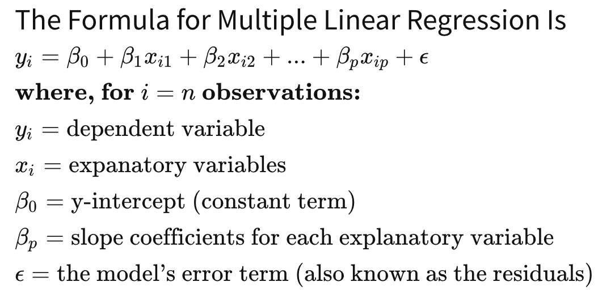

# MULTIPLE LINEAR REGRESSION
Multiple linear regression (MLR), also known simply as multiple regression, is a statistical technique that uses several explanatory variables to predict the outcome of a response variable. 

# Steps
## Data preprocessing
## Import  LinearRegression Class in Sci kit learn
## Fit the model to the data
## Predict on test values
## Find Accuracy

# Backward Elimination Method

## Select a significance level (sl)
## Fit the full model with all possible predictors
## Consider the predictor with highest p value; if p value>sl them proceed otherwise finish
## Remove the selected predictor and refit the model.
