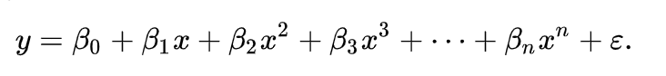
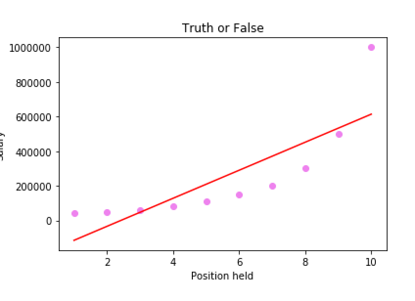
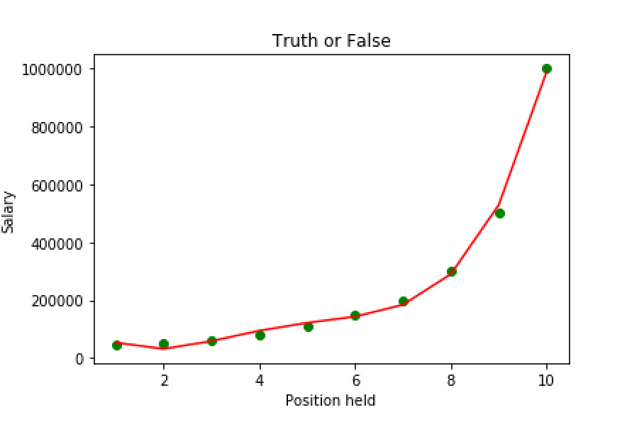

# Polynomial Linear Regression

 polynomial regression is a form of regression analysis in which the relationship between the independent variable x and the dependent variable y is modelled as an nth degree polynomial in x.
 It is like a special case of multiple linear regression
 
 
 

  

## Problem Statement
An employee joining a new company tell that he was a 6.5 level emplyee in his former company and and had a salary of 160K.The HR however is not conviced and decided to check whether the person is honest or not.

## Solution
Salary of employees based on their levels is predicted by both linear regression and polynomial regression  

## Result

By Linear regression model
 

By Polynomial Regression
 

Since the model predicts the salary to be 158862.45 ,means employee was honest.
