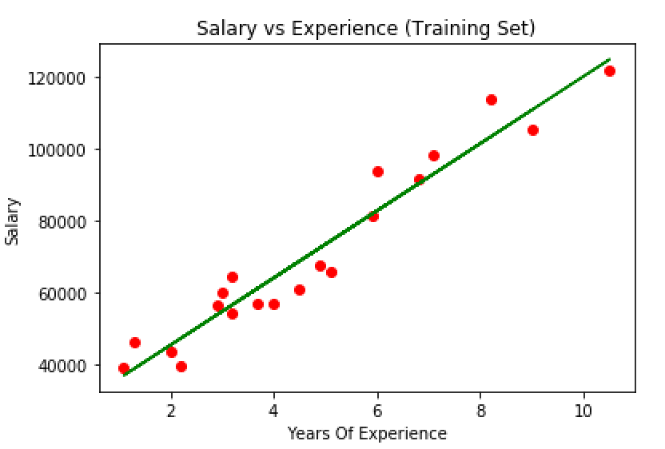
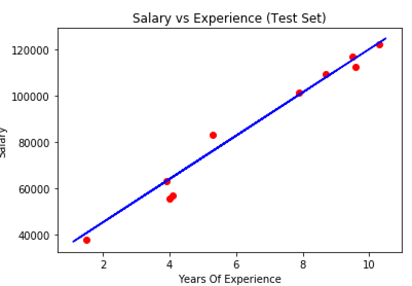

# SIMPLE LINEAR REGRESSION
In statistics, simple linear regression is a linear regression model with a single explanatory variable. it concerns two-dimensional sample points with one independent variable and one dependent variable .<br/>

```
      y=b0+b1x
```
How to find line of best fit?<br/>
 -  by ordinary least square method.
# STEPS
## Data preprocessing
Refer the data preprocessing repo to understand preprocessing.
## Import  LinearRegression Class in Sci kit learn
## Fit the model to the data
## Predict on test values
## Find Accuracy
## Plot the traning set plot
<p align="center">

</p>

## Plot the test set plot
<p align="center">
</br>
